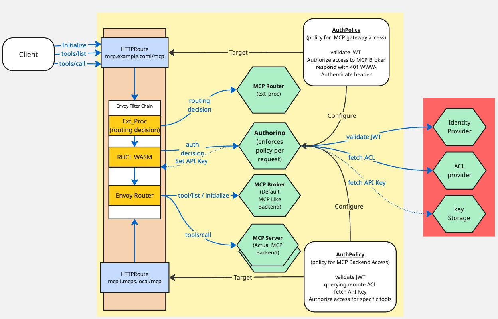

# Auth with the MCP Gateway (Phase 1)

**Goals**

- Provide OAuth integration at the gateway that aligns with the [MCP Spec Authorization](https://modelcontextprotocol.io/specification/draft/basic/authorization) leveraging resource_metadata, dynamic client registration and token validation.
- Provide examples for authorizing access to specific tools.
- Enabled exchange from bearer token to legacy API key via vault


**Out of scope for this phase**

- HTTP message signing as specified under https://github.com/modelcontextprotocol/modelcontextprotocol/issues/1415 .
- OAuth token exchange. Allowing the original token to be exchanged for one with a specific set of scopes and audiences.
- Tool list filtering. The list of tools sent back to the user filtered to only show the tools they have access to.


**Caveats and Tradeoffs for this Phase** 

> Note:  We plan more than 1 phase so these tradeoffs should be considered specific to this phase.

- The scopes requested by the client will need to cover the requirement of all MCP Servers behind the gateway.
- The audience of the token is assumed to be common across the MCP servers or include all audiences.
- All MCP servers are assumed to be using a single IDP.


## Overview

To provide auth integration, the MCP gateway uses [Kuadrant](https://kuadrant.io), in particular [AuthPolicy](https://docs.kuadrant.io/1.2.x/kuadrant-operator/doc/reference/authpolicy/), Gateway API and Keycloak as an identity provider. This is our reference implementation, but it is of course possible to use other components that offer these capabilities and integrate with Envoy. The MCP Gateway components don't stray into client auth and remain focused on routing and brokering.

> Note while we use Keycloak in our examples, other IDPs could also be used.
> Note while we use Kuadrant to enforce auth requirements, it could be done in other ways.




> Note: if you want to try what this document outlines you can do so via the instructions at [Example Oauth Setup](../../README.md#example-oauth-setup)

## Implementation


### Protecting the MCP Gateway HTTP endpoint(s)

The MCP gateway exposes a single endpoint via the Ingress gateway that acts as an MCP server to MCP clients. It is this host and path the client will connect to. To enforce authenticated access, the gateway `HTTPRoute` exposing the MCP gateway to clients, uses a Kuadrant AuthPolicy resource. This resource can define what authentication must be met and also enforce authorization requirements:

[Example AuthPolicy](./../../config/mcp-system/authpolicy.yaml)


With this policy in place any unauthenticated request not going to the /.well-known endpoints will get a 401 and WWW-Authenticate header with a resource_metadata url specified. It is then up to the client to leverage this information to retrieve the resource metadata to know how to authenticate to access the resource. 

> To understand the full flow including the defined Auth server take a look at [MCP Gateway Auth Sequence Diagram](./flows.md#mcp-gateway-request-authentication)


### OAuth Resource Metadata

The MCP Broker will be responsible for serving the resource metadata to clients. For phase 1 it will be built via a set of env vars provided to the broker. The broker is merely serving this resource and does nothing else with it.

#### Registering scopes

As the MCP gateway is aggregating multiple MCP Servers together. We need to know what scopes are required when asking for a token from the auth provider. For phase 1 this set of scopes will be aggregated together.


In phase 1, the values for the properties below can be set via an Env Var passed into the broker. 


example response:

```json

{
  "resource_name":"MCP Gateway",
  "resource":"http://mcp.127-0-0-1.sslip.io:8888/mcp",
  "authorization_servers":["http://keycloak.127-0-0-1.sslip.io:8888/realms/mcp"], 
  "bearer_methods_supported": ["header"],
  "scopes_supported":["email","role","user","groups"]
}

```

- ```resource:``` this property will be calculated based on the host and path of the MCP gateway.

- ```authorization_servers:``` this property is expected to an IDP that is support OAuth and is used by each of the MCP servers using OAuth.

- ```bearer_methods_supported:``` this will always be set to header.


- ```scopes_supported:``` This is an aggregated list of scopes for the MCP servers.

> As we are using an aggregated set of scopes, the client and token will be highly privileged. This is something we will look to address in phase 2 via token exchange.

> As we will pass on this token in phase 1 it is expected that the audiences of the token include audiences required by all MCPs or they have a shared audience.

> It is expected that the Identity Provider support [dynamic client registration](https://www.keycloak.org/securing-apps/client-registration#_openid_connect_dynamic_client_registration).

### Authenticated MCP Gateway Calls

Once a client has obtained a token, it can then make requests to the MCP Gateway. When a request comes to the gateway, the Kuadrant WASM plugin intercepts this request and based on configuration, will decide whether or not to call to the Authorino component. With the [Example AuthPolicy](./../../config/mcp-system/authpolicy.yaml), Authorino will receive the request and then validate the token with the configured auth server before allowing the request to continue.

### Token Exchange for Legacy API Keys

Some MCP Servers may use legacy API Keys. As part of defining the AuthPolicy that protects access to the MCP servers, just as we fetched an ACL from a HTTP endpoint, you can also have it fetch an API Key from a provider that exposes a HTTP interface such as Vault. An example of doing this and setting the value into the request header for the targeted MCP Server will also be provided as an example AuthPolicy. It is possible to define an individual AuthPolicy per MCP Server backend as each MCP Server registered has a corresponding HTTPRoute attached to the Gateway. See the [routing doc](../design/routing.md).

### Authorization of specific MCP tools/calls

When the router receives a tools/call, it sets some headers for use by other components.

`x-mcp-toolname:` used to indicate what tool (including prefix) is being accessed
`x-mcp-method:` used to indicate the json RPC method being called

There is an [example second AuthPolicy](../../config/mcp-system/tool-call-auth.yaml) that targets a second listener in the Gateway that is dedicated to routing MCP server requests. This AuthPolicy, via Authorino, fetches metadata that defines an ACL. This is a simplistic example to illustrate how data can be fetched dynamically to make these decisions. It then uses this data in the authorization phase to allow or deny access.
In addition to this simplistic ACL, we will also provide an example that uses the Keycloak resource roles feature to define access to tools.

AuthPolicy here uses 3 key phases

1) Authentication (where the token is validated)
2) metadata (where additional data is fetched before authorization)
3) Authorization (where an authorization decision is made) 

This is an illustration of the Auth pipeline that AuthPolicy provides.
 