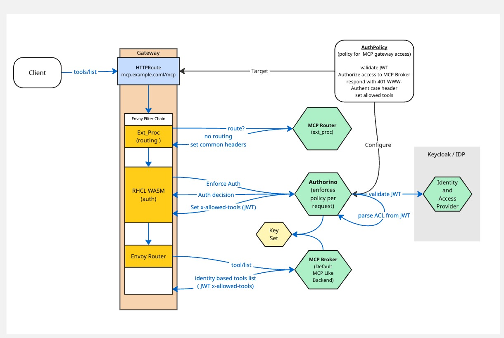
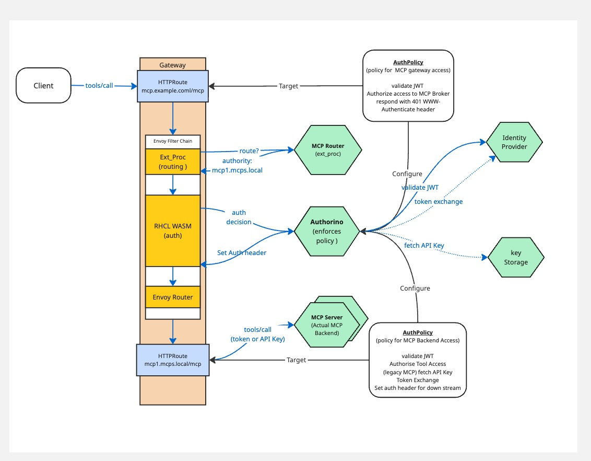

# Auth with the MCP Gateway (Phase 2)

Following on from [Auth Phase 1](./auth-phase-1.md),  we will now also show how to provide authorization capabilities to enable identity based tool filtering and token exchange capabilities at the gateway via AuthPolicy and Kuadrant integration to reduce the scope of the token passed on to backend MCP servers and to ensure tools returned from the gateway are based on identity. 

> Note while we use Keycloak in our examples, other IDPs could also be used.

> Note while we use Kuadrant to enforce auth requirements, it could be done in other ways.


**Goals**

- Provide the capability of informing the gateway via a trusted mechanism of the subset of tools a client doing a `tools/list` is allowed to see based on their identity so that the list response can be filtered down to only the permitted tool set. 

- Provide a mechanism for doing token exchange at the Gateway based on the target MCP for a given tool/call to reduce scope and audience of the token passed to the backend MCP server.


**Constraints**

- We will use Keycloak as the identity provider
- We will use AuthPolicy from the Kuadrant project to protect the gateway


### Identity based tool filtering



In order to filter down the available tools either generally or within the context of a virtual MCP, based on the auth integration, a trusted source can set a header `x-allowed-tools`. This header is expected to be in JWT format signed by trusted key pair with the public element being shared with the broker via env var `TRUSTED_HEADER_PUBLIC_KEY`. The list of tools has to be a claim within this JWT with a key `allowed-tools` and a value as shown below.  The broker will look for this header during a tools/list call. If set it will validate the JWT, extract the allowed tools and ensure the returned tools are matched against this list. If it fails to validate the header it will return an empty list. 

Example JWT payload 

```json
{
  "allowed-tools": "{\"server1.mcp.local\":[\"greet\"],\"server2.mcp.local\":[\"headers\"],\"server3.mcp.local\":[\"add\"]}",
  "exp": 1760004918,
  "iat": 1760004618,
  "iss": "Authorino",
  "sub": "fbd8ed47a62069bb1d7f328c4c25c47eef49486a3c71cfd179bf17946dc86637"
}

```


The MCP Broker when receiving a tools/list call. Will validate the JWT token if present in the request, and load the rbac data from the config. As it has access to the JWT it can identify which tools should be returned based on this configuration. 

We have provided an [example Authpolicy](../../config/samples/oauth-token-exchange/tools-list-auth.yaml) showing how to do this using Keycloak to set the access and provide the authentication. We then use the [wristband](https://github.com/Kuadrant/authorino/blob/main/docs/features.md#festival-wristband-authentication) feature of AuthPolicy and Authorino to create a signed JWT to securely carry this information to the MCP Broker. 

### Token Exchange


There are two key uses cases here:

1) exchanging the token for an API key stored in a secret store such as Vault.
2) exchanging the token for another access token that has specific scopes and audiences




#### API Keys

For use case one the solution is to have AuthPolicy fetch the token from the secret store such as Vault and then add that as the API Key in the request headers before the request is routed on to the backend MCP Server. 


#### Token Exchange


In order to provide token exchange it is expected that there is a confidential client in the identity provider for Authorino to use to perform the token exchange. Then an AuthPolicy is put in place to protect tool calls [example token exchange policy](../../config/samples/oauth-token-exchange/tools-call-auth.yaml). In this policy we use the client id and secret from this confidential client to call to Keycloak and do the token exchange once the incoming gateway JWT has been validated. The token exchange response is parsed and the new token set as the `Authorization:` header once all other authorization checks in the AuthPolicy have succeeded.

** A note on scopes and audiences **

In our example we set a default audience in the new token of the mcp server host and a default scope of `oidc`. However using the [defaults and overrides](https://docs.kuadrant.io/latest/kuadrant-operator/doc/overviews/auth/#defaults-and-overrides) feature of AuthPolicy these values could be overridden at the HTTPRoute level 
