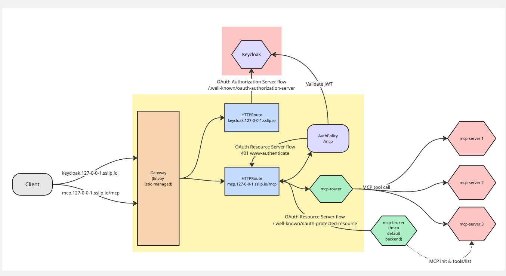

## Auth with the MCP Gateway (Phase 1)

To provide auth intetgration, the MCP gateway uses (Kuadrant)[https://kuadrant.io] and Gateway API in combination with Keycloak as an identity provider.

We are bringing these components together to provide a reference implementation of the OAuth 2.0 Protected Resource Metadata as per the (MCP Authorization)[https://modelcontextprotocol.io/specification/draft/basic/authorization]  and a reference implementation for authorizing access to particular tool.

> Note while we use keycloak in our examples, in theory other IDPs could also be used.


### Authentication Implementation



### Protecting the MCP Gateway HTTP endpoint(s)

In order to enforce authenticated access, the gateway listeners exposing the MCP gateway to clients, can use a kuadrant `AuthPolicy` resource. This resource can define what authentication must be met and also enforce Authz requirements at the gateway (Authorization Covered Below).

[Example AuthPolicy](./../../config/mcp-system/authpolicy.yaml)

[Example Oauth Setup](../../README.md#example-oauth-setup)

With this policy in place any unauthenticated request not going to the /.well-known endpoints will get a 401 with a resource_metadata url specified. It is then up to the client to leverage this information to retrieve the resource metadata to know how to authenticate to access the resource (example resource would be /mcp). This resource metadata will be served via the MCP Broker component. 

To understand the full flow including the defined Auth server take a look at [MCP Gateway Auth Sequence Diagram](./flows.md#mcp-gateway-request-authentication)


### Registering required scopes

As the MCP gateway is aggregating multiple MCP Servers together. We need to know what scopes are required when asking for an authorization token from the auth provider.  To do this each MCP server registered via the `MCPServer` resource that targets a HTTPRoute at the Gateway will declare its required scopes:


```yaml

## not actual implmentation may be slightly different.

name: accounting_mcp
  spec:
    # Reference all three test MCP servers via their HTTPRoutes
    targetRefs:
    # Server 1 - Go SDK based (hi, time, slow, headers tools)
    - group: gateway.networking.k8s.io
      kind: HTTPRoute
      name: mcp-server1-route
    toolPrefix: s3_
    auth: #just an example that may work
      scopes: 
        - email
        - role
        - user
      rbac:
        - role: accounting
          tools: 
            - "payroll"
        - role: admin
          tools: 
            -"*"

```

For phase1 this set of scopes will be aggreggated together via the MCP Server controller into the config for the MCP Broker. The MCP broker is then responsible for serving the aggregated scopes via `./well-known/oauth-protected-resource` endpoint. 

```json
{
  "resource_name":"MCP Server",
  "resource":"http://mcp.127-0-0-1.sslip.io:8888/mcp",
  "authorization_servers":["http://keycloak.127-0-0-1.sslip.io:8888/realms/mcp"],
  "bearer_methods_supported": ["header"],
  "scopes_supported":["email","role","user"]
}

```

> Note In a future phase these defined scopes may be used to define a token exchange to scope down the token to only the required scopes. 

### Registering MCP Auth Severs

Part of the response from the `oauth-protected-resource` endpoint is an array of `authorization_servers`. For phase 1 the gateway will only support a single auth server. The expectation is each of the MCPServers using OAuth is using the same auth server and will independantly validate the token against that auth server. The MCP Broker will be configured with this shared server separately via a flag or EnvVar.

> Note this doesn't include URL elicitation where an MCP server may request a user provide it access to a resource not protected by the defined auth server. Example a github resource/API. This is consisdered seaparate from the general Gateway authentication and authorization requirement.

### Authenticated Calls

Once a client has obtained a token. It can then make requests to the MCP Gateway. When a request comes to the gateway. The Kuadrant WASM plugin intercepts this request and based on configuration, will decide whether or not to call to the Authorino component. With the linked AuthPolicy, Authorino will recieve the request and then validate the token with the configured auth server before allowing the request to continue. 

> Note not covered here is message signinging as specified under https://github.com/modelcontextprotocol/modelcontextprotocol/issues/1415 . This will be covered at a later phase. 


### Authorization of tools/calls

When the router recieves a tools/call. It will load from the config the rbac section for the specified mcp server. It will then set this data into the dynamic metadata via the `ext_auth_data` namespace. Optionally we could also encode this data and set it as a request header. The reason for this is to allow down stream filters to access this information to make authorization decisions. 
To do this we will update the envoy filter to allow it define metadata: https://www.envoyproxy.io/docs/envoy/latest/api-v3/extensions/filters/http/ext_proc/v3/ext_proc.proto#envoy-v3-api-msg-extensions-filters-http-ext-proc-v3-metadataoptions 

```yaml
metadata_options:
  recieving_namespaces:
    untyped:
      - ext_auth_data
```                  


Note> We will use AuthPolicy to enforce the tool access check as a reference of how you can achieve this integration with the gateway and Kuadrant. 


### Filtering of tools

The broker when recieving a tools/list call. Will validate the JWT token if present in the request, and load the rbac data from the config. As it has access to the JWT it can identify which tools should be returned based on this configuration. 

Note > not covered here is the removal of tools altogether (allowing a developer not to expose a certain tool) that is considered separate. 