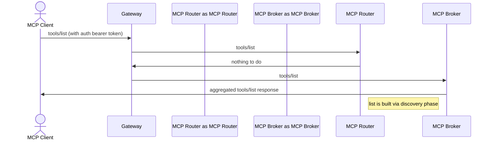
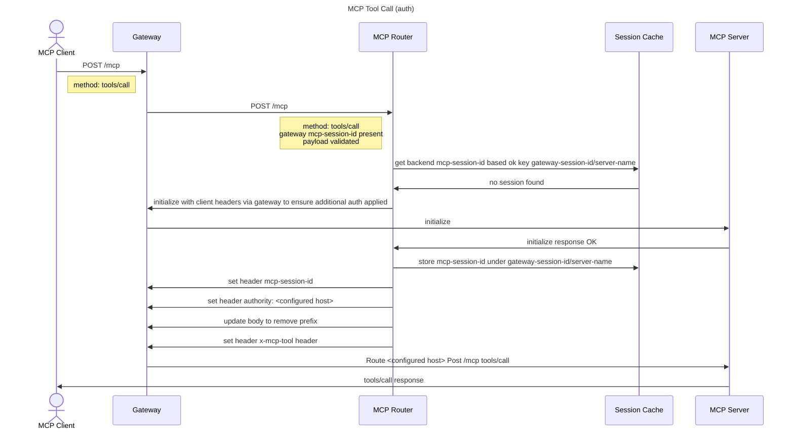
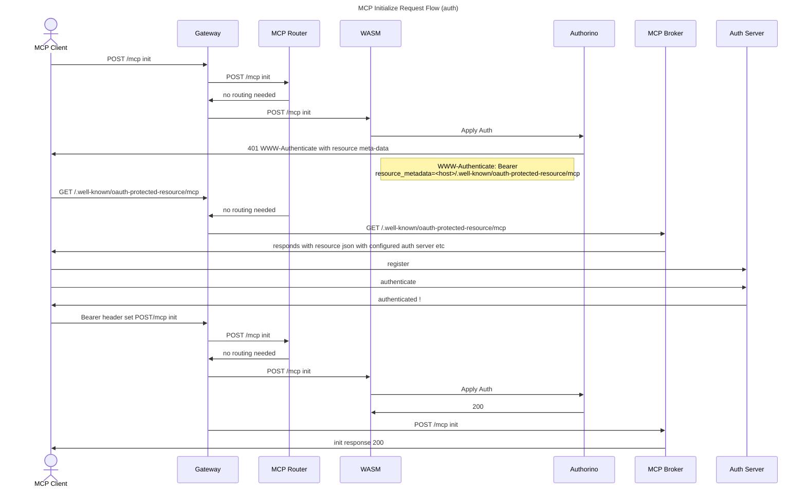
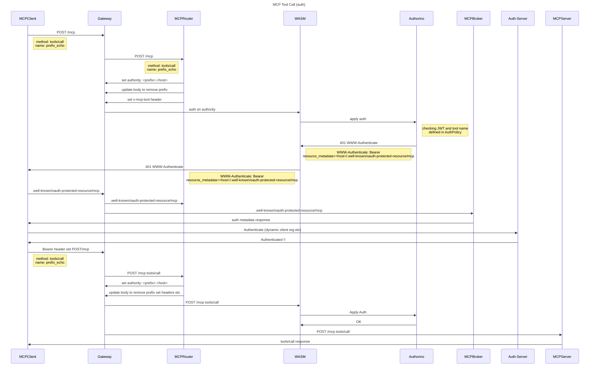

# MCP Gateway Request Flows

Below are some theorized flows. They are likely to adapt and change as we get deeper into the weeds. The idea is to illustrate how it "might" work rather than dictate how it "should" work. 

> note: Some show "no auth" this is to reduce noise and focus on the main flow.

## MCP Server Registration

For detailed information on how MCP server registration works, including the MCPManager lifecycle and configuration change handling, see the [server registration design documentation](./server-registration.md).

## Initialize:

## Aggregated Tools/List (no auth)

## Tools/Call (no auth)

## Auth

Below are some attempts with Auth in the mix. Still need some refinement of these flows

## MCP Gateway Request Authentication

## MCP Server Tool Call with Auth

## MCP Notifications

For detailed information on how notifications work in the MCP Gateway, see the [notifications design documentation](./notifications.md).
