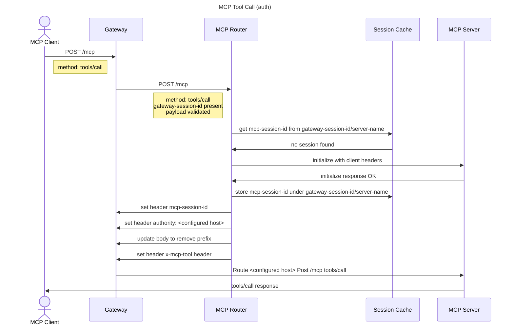
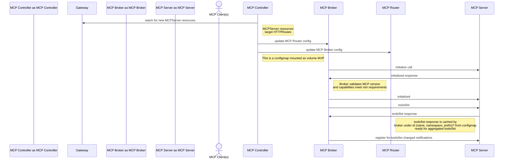
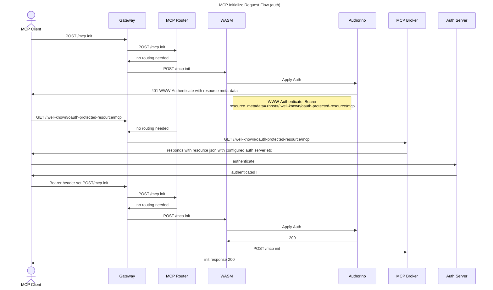
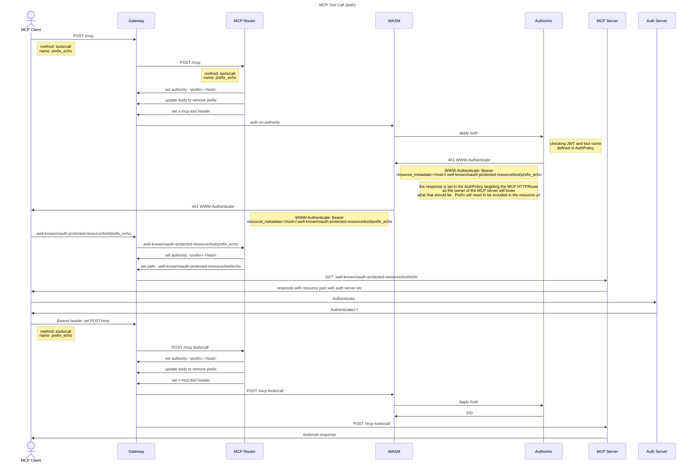

# MCP Gateway Request Flows


Below are some theorised flows. They are likely to adapt and change as we get deeper into the weeds. The idea is to illustrate how it "might" work rather than dictate how it "should" work. 

> note: Some show "no auth" this is to reduce noise and focus on the main flow.

## Initialize:


## Tools/Call (no auth)



## Discovery



## Aggregated Tools/List (no auth)


## Auth

Below are some attempts with Auth in the mix. Still need some refinement of these flows

## MCP Gateway request Auth required (initialize for example)




## MCP Server Tool Call with Auth



## MCP Notifications

TODO (recommend scoping to just tools/list_changed) notifications initially.

The GET /mcp request will fall through to the MCP Broker.
MCP broker will see the registered session id and any send any ```tools/list_changed` notifications recieved via its own notifications connection to the backend MCP servers to any registered clients.