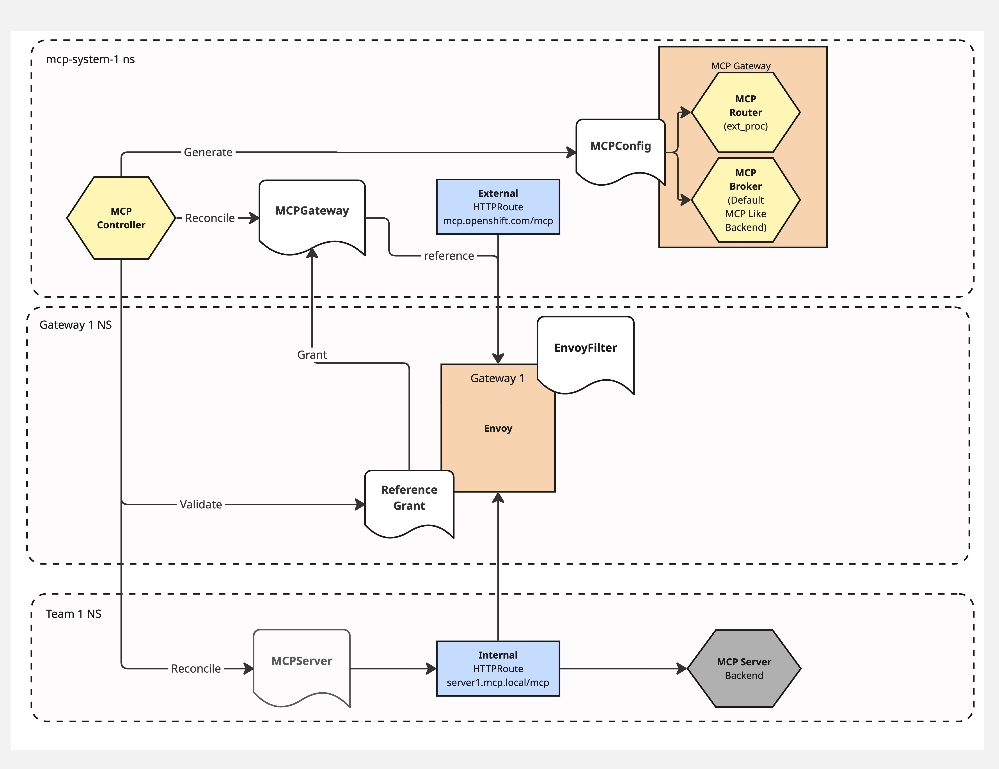

# Isolated Gateway Deployment

## Terms

**MCP Gateway Instance**: A single deployment of the broker and router components within a given namespace.

## Use Cases

- Allow platform administrators to configure isolated MCP Gateways to segregate data and workloads according to their needs.
- Allow multiple Gateway API `Gateway` resources to be handled by a single MCP Gateway deployment.

## Overview

> Note: The existing MCP controller component is expected to evolve into a full operator capable of both reconciling MCPServer instances and deploying MCP Gateway instances into targeted namespaces. This design reflects a step towards that future.

The existing behavior of the MCP Controller, which has remained in place from the proof of concept (PoC), is to:
1. Discover all MCPServer resources across the cluster
2. Construct a unified MCP configuration from them
3. Create that configuration in a known secret in the `mcp-system` namespace
4. Mount this secret into the broker and router components

The broker and router are unaware of Kubernetes by design. Achieving isolation by deploying multiple MCP Gateway instances in different namespaces and manually constructing the configuration for each deployment is already possible, but it would be cumbersome and would require abandoning the MCP controller.

The changes proposed here focus on the MCP controller and how it manages and constructs the correct configuration while becoming aware of each MCP Gateway instance.

## Proposal

To achieve isolated deployments, the cluster-scoped MCP controller must construct a restricted MCP configuration that only contains MCP servers within the scope of a given Gateway, rather than aggregating all servers across the entire cluster to a single MCP Gateway instance.

### Introduce MCPGateway CRD

To support this deployment model and inform the controller of the expected state, we will add a new CRD: `MCPGateway`. This CRD can be created in any namespace where an MCP Gateway instance is deployed (MCP Gateway instances are currently limited to 1 per namespace).

This resource signals to the controller that any MCP configuration built from MCPServers targeting HTTPRoutes attached to that gateway should be placed in the well-known secret within the same namespace as the MCPGateway resource.

The MCPGateway can target Gateway API `Gateway` resources in any namespace. To ensure cross-namespace targeting is authorized, the requirement of a [ReferenceGrant](https://gateway-api.sigs.k8s.io/api-types/referencegrant/) in the targeted gateway's namespace will be enforced unless the MCPGateway resource is in the same namespace as the Gateway (see diagram below).

**Example Resources:**

```yaml
apiVersion: mcp.kuadrant.io/v1alpha1
kind: MCPGateway
metadata:
  name: team1
  namespace: team1
spec:
  targetRefs:
    - name: gateway
      namespace: gateway-system
status:
  conditions:
    - type: Ready
      status: "True"
      reason: ReferenceGrantExists
---
apiVersion: gateway.networking.k8s.io/v1
kind: ReferenceGrant
metadata:
  name: grant-team1
  namespace: gateway-system
spec:
  from:
    - group: mcp.kuadrant.io
      kind: MCPGateway
      namespace: team1
  to:
    - group: gateway.networking.k8s.io
      kind: Gateway
```

> Note: The MCPGateway resource is expected to trigger the installation and configuration of an MCP Gateway instance in the future, so the spec will likely expand.

### MCPGateway Controller Behavior

The MCP Controller will reconcile this new resource in a dedicated MCPGateway controller. This controller will:

1. Verify that if an MCPGateway targets a Gateway in another namespace, an associated ReferenceGrant exists
2. Update the MCPGateway status accordingly (without revealing whether the targeted Gateway resource exists)
3. Watch for deletion or changes to ReferenceGrants and trigger reconciliation of affected MCPGateway resources

### MCPServer Controller Behavior

When the existing MCPServer Controller finds an MCPServer resource, it will:

1. Look up the targeted HTTPRoute and its parent gateways
2. Look for either a ReferenceGrant in that parent's namespace or an MCPGateway resource in the same namespace
3. If no valid objects are found, update the MCPServer with a status of `NotReady` and reason `NoValidMCPGateway`. The configuration for that server will not be added to any MCP Gateway deployment.
4. For each valid configuration found, add the MCP configuration secret to the same namespace as the MCPGateway resource (either via ReferenceGrant or by being co-located with the Gateway).

### Deploying Multiple Broker and Router Instances

In this initial phase, users will use the Helm charts to deploy the broker and router into a namespace. The Helm chart will also configure the MCPGateway, EnvoyFilter, and any required ReferenceGrants. In the future, this will also be offered by an operator.

**Diagram**

> Note: The MCP Controller does not need to be in the same namespace as the MCPGateway. It is shown that way here purely to reduce noise. 



- EnvoyFilter brings traffic to the correct MCP Gateway
- MCPGateway ensures that MCP Gateway receives the correct MCPConfig
- MCPServer indicates MCP configuration should be generated for this HTTPRoute

### Targeting Multiple Gateways with a Single MCPGateway

An MCPGateway resource can target multiple Gateway resources. As long as there is a ReferenceGrant or the MCPGateway is in the same namespace as the Gateway, this will result in an updated configuration for the MCP Gateway components. This assumes there is an EnvoyFilter for each of these gateways pointing to the same MCP Gateway instance.

## Updating Existing Deployment

Ideally, users can re-run the Helm chart to bring their installation up to date. The required changes are:

1. Create an MCPGateway resource in the `mcp-system` namespace targeting the `gateway-system` gateway
2. Create a ReferenceGrant in the `gateway-system` namespace allowing the cross-namespace reference

## Installation Process

Use Helm to install (this adds MCPGateway and ReferenceGrants to the existing resources). Specify:
- The namespace for the Gateway
- The namespace for the MCPGateway

## Limitations

There can only be one MCPGateway resource per namespace: 
    
The MCPGateway resource indicates to the controller where it should create the configuration. This configuration is mounted into the router and broker components via a named secret. Having multiple MCPGateway resources in a single namespace would result in the secret being overwritten, causing inconsistent behavior. This limitation can be addressed once we add an operator.
