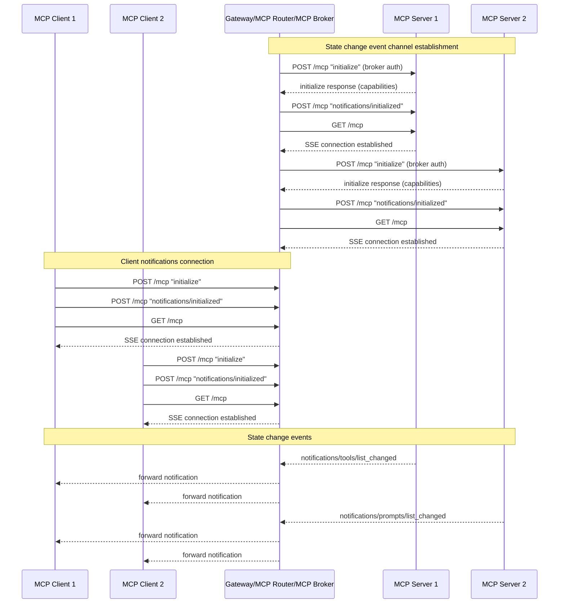
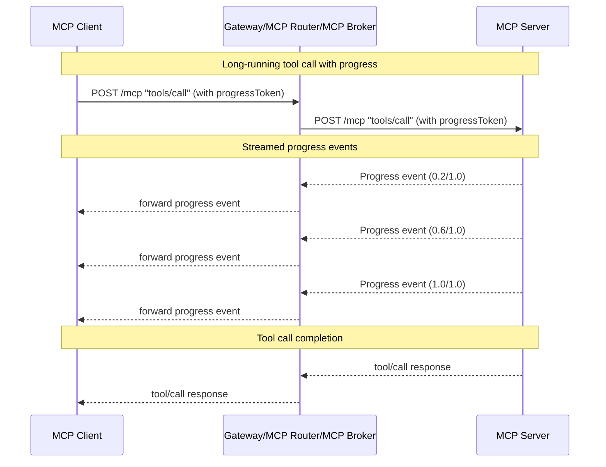
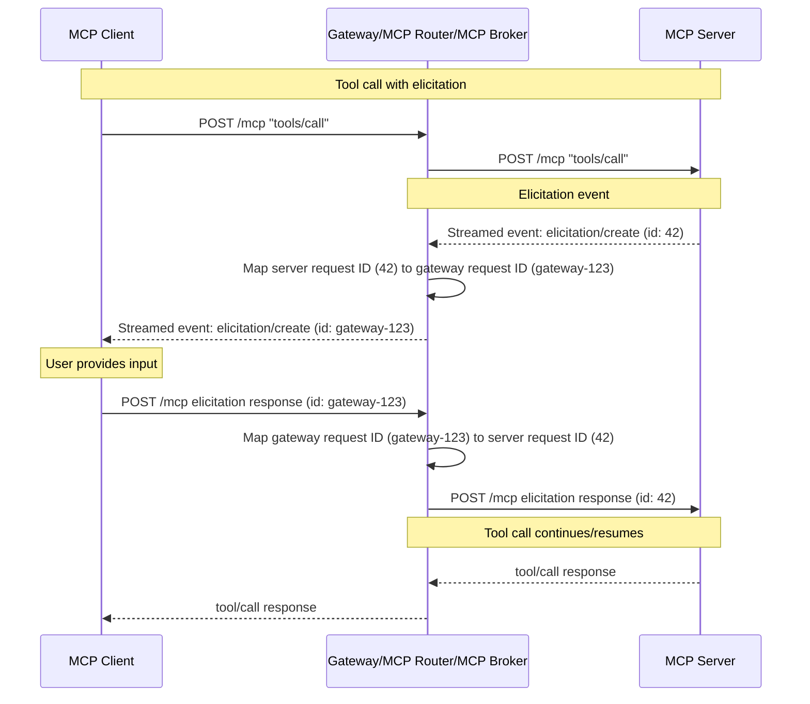

## Notifications

### Problem

The MCP protocol supports real-time notifications that enable servers to inform clients about changes without being explicitly requested. These notifications are crucial for maintaining synchronization between clients and servers when:

- Tool lists change (e.g., `notifications/tools/list_changed`)
- Resource lists change (e.g., `notifications/resources/list_changed`) 
- Prompt lists change (e.g., `notifications/prompts/list_changed`)
- Root lists change (e.g., `notifications/roots/list_changed`)
- Long-running tool calls emit progress updates
- Elicitation requests are made (e.g., `elicitation/create`) - This is particularly important for prompting users before destructive actions, and for out-of-band authentication URL elicitation (see [MCP GitHub issue #1036](https://github.com/modelcontextprotocol/modelcontextprotocol/issues/1036))

For more details on MCP notifications, see the [MCP Architecture documentation](https://modelcontextprotocol.io/docs/learn/architecture#notifications).

In the MCP Gateway architecture, clients connect to the gateway's `/mcp` endpoint, which is backed by the MCP Broker. The broker aggregates multiple backend MCP servers and presents them as a unified MCP server to clients. This aggregation creates a challenge: how should notifications from individual backend MCP servers be forwarded to the appropriate clients?

The gateway uses a **lazy initialization** approach where backend sessions to MCP servers are only established when a client makes a tool call. However, some notifications (like `list_changed` notifications) are logically 'broadcast' notifications and should be sent to all connected clients, not just those who have made tool calls.

### Solution

The MCP Gateway supports two distinct types of notification mechanisms:

1. **State Change Events**: Notifications that are safe to send to all connected clients (e.g., `notifications/tools/list_changed`, `notifications/resources/list_changed`, `notifications/prompts/list_changed`, `notifications/roots/list_changed`). These are received via persistent Server-Sent Events (SSE) connections the broker maintains to all backend MCP servers using the broker's configured authentication credentials.

2. **Client-Specific Events**: Events related to specific client sessions that are streamed as part of tool call responses:
   - Progress updates for long-running tool calls
   - Elicitation requests that require client interaction

The broker maintains a Server-Sent Events (SSE) connection with each connected client for receiving state change events. When the broker receives a state change event from a backend MCP server, it forwards it to all currently connected clients via their respective GET connections.

> Note: For detailed information on MCP notification specifications, see the [MCP Prompts specification](https://modelcontextprotocol.io/specification/2025-06-18/server/prompts#list-changed-notification) and the [MCP Architecture documentation](https://modelcontextprotocol.io/docs/learn/architecture#notifications).

### Notification Architecture

#### State Change Events

State change events are notifications that are safe and appropriate to send to all connected clients. The gateway supports the following state change events:

- `notifications/tools/list_changed` - When a backend MCP server's tool list changes
- `notifications/resources/list_changed` - When a backend MCP server's resource list changes  
- `notifications/prompts/list_changed` - When a backend MCP server's prompt list changes
- `notifications/roots/list_changed` - When a backend MCP server's root list changes

**How State Change Events Work:**



1. **Capability Checking**: When a backend MCP server is discovered, the broker first sends an `initialize` request using the broker's configured authentication credentials. The broker checks the `initialize` response to determine which state change event [capabilities](https://modelcontextprotocol.io/specification/2025-06-18/server/resources) the server supports (e.g., `notifications/tools/list_changed`, `notifications/resources/list_changed`, etc.).

2. **Persistent Broker Connections**: For each backend MCP server that supports state change events, the broker establishes a persistent GET connection:
   - Sends a `notifications/initialized` notification
   - Establishes a GET `/mcp` connection for receiving SSE notifications
   
   These connections remain open for the lifetime of the backend server connection. The broker must implement reconnection logic to handle cases where connections are dropped due to server restarts, session invalidation, or network issues.

3. **Event Reception and Forwarding**: When a backend MCP server sends a state change event (e.g., `notifications/tools/list_changed`), the broker receives it via the persistent connection and forwards it to all currently connected clients via their respective GET connections.

4. **Client Response**: Clients typically respond to `list_changed` notifications by making a new `tools/list`, `resources/list`, `prompts/list`, or `roots/list` request to refresh their understanding of available primitives.

**Why Broker Auth for State Change Events:**

The broker uses its own authentication credentials (configured at startup) rather than client credentials because state change events are not tied to any specific client session, must be received even when no clients have made tool calls yet, and allows the broker to maintain a single persistent connection per backend server rather than per client.

#### Client-Specific Events

Client-specific events are related to a particular client's tool execution and are delivered as streamed events within the tool call POST response, not via separate GET notification channels. The gateway supports two types of client-specific events:

1. **Progress Updates**: Progress notifications for long-running tool calls
2. **Elicitations**: Requests for user input during tool execution (e.g., confirming destructive actions)

> **Note**: The gateway does not currently support other client-specific notifications/events such as:
> - Log message notifications (`logging/setLevel` and `notifications/message`) - See [MCP Logging specification](https://modelcontextprotocol.io/specification/2025-06-18/server/utilities/logging#log-message-notifications)
> - Subscribe requests (`resources/subscribe` and `notifications/resources/updated`) - See [MCP SubscribeRequest schema](https://modelcontextprotocol.io/specification/2025-06-18/schema#subscriberequest)

**How Progress Updates Work:**

Progress updates are streamed events sent by the backend MCP server as part of the `tools/call` POST response. The client indicates they want progress updates by including a `progressToken` field in the tool call request with an arbitrary value. The backend server uses this token to associate progress events with the specific tool call. See the [MCP Progress specification](https://modelcontextprotocol.io/specification/2025-06-18/basic/utilities/progress#progress) for more details.



**How Elicitations Work:**

Elicitations allow backend MCP servers to request user input during tool execution. When an `elicitation/create` event is sent, the tool call on the server halts, waiting for the client's response. The elicitation message contains a unique request ID that the client must use when responding. See the [MCP Elicitation specification](https://modelcontextprotocol.io/specification/2025-06-18/client/elicitation#elicitation) for more details.

The gateway must intercept and modify the request ID in the elicitation message to enable proper routing of the client's follow-up response to the correct backend MCP server.



**Example Elicitation Message:**

```json
{
  "method": "elicitation/create",
  "params": {
    "message": "Please provide inputs for the following fields:",
    "requestedSchema": {
      "type": "object",
      "properties": {
        "name": {
          "title": "Full Name",
          "type": "string",
          "description": "Your full, legal name"
        },
        "check": {
          "title": "Agree to terms",
          "type": "boolean",
          "description": "A boolean check"
        }
      },
      "required": ["name"]
    }
  },
  "jsonrpc": "2.0",
  "id": 1
}
```

**Example Client Response:**

```json
{
  "result": {
    "action": "accept"
  },
  "jsonrpc": "2.0",
  "id": 1
}
```

**Request ID Mapping for Elicitations:**

Since elicitation responses arrive as new POST requests from the client, the gateway must maintain a mapping that associates:
- The gateway-assigned request ID (sent to the client)
- The original backend server request ID
- The backend server session (for routing)

When forwarding an elicitation to the client, the gateway replaces the backend server's request ID with a gateway-specific ID. When the client responds, the gateway uses the mapping to restore the original request ID and route the response to the correct backend server session.

### Implementation Considerations

1. **Connection Management**: The broker must efficiently manage multiple concurrent connections:
   - One persistent GET connection per backend MCP server (for state change events)
   - One GET connection per connected client (for receiving state change events)
   - Long-running POST connections for tool calls that emit progress updates or elicitations

2. **Capability Detection**: The broker must check the `initialize` response from each backend MCP server to determine which state change event capabilities are supported before establishing GET notification connections.

3. **Request ID Mapping**: The broker must maintain a mapping table for elicitation request IDs that includes:
   - Gateway-assigned request ID
   - Original backend server request ID
   - Backend server session information
   - Expiration/TTL to clean up stale mappings
   
   **Request ID Type Handling**: Backend MCP servers may use request IDs of different types (string, integer, or float). The gateway implementation must:
   - Preserve the original backend server request ID type when restoring it in the client's response
   - From the gateway's perspective, gateway-assigned request IDs could use strings with a pattern (e.g., prefixing the server name) to ensure uniqueness and enable routing, though specific implementation details are left to implementation time
   - Test scenarios with string, integer, and float request IDs from backend servers to ensure proper type preservation and routing

4. **Error Handling and Reconnection**: The broker must handle:
   - Backend MCP server connection failures
   - Client connection failures
   - Event delivery failures
   - Connection retry logic with exponential backoff
   - Automatic reconnection when backend servers restart
   - Session invalidation detection and reconnection
   - Network interruption recovery

5. **Lifecycle Management**: The broker must properly:
   - Establish state change event connections when backend servers are discovered (after capability checking)
   - Clean up connections when backend servers are removed
   - Manage long-running POST connections for tool calls with progress/elicitation
   - Clean up request ID mappings when tool calls complete or timeout

### Security Considerations

1. **Event Validation**: The broker should validate that state change events received from backend MCP servers are well-formed and safe to forward before broadcasting them to clients.

2. **Authorization**: The broker forwards events as-is but relies on the backend MCP server's authorization rules, if any, tied to the broker auth credentials configured for each MCP Server.

3. **Request ID Mapping Security**: The gateway-assigned request IDs in elicitation mappings should be cryptographically random and unguessable to prevent unauthorized access to tool call sessions.

### Open Questions

1. **Elicitation Mapping Cleanup**: What is the appropriate timeout/TTL for elicitation request ID mappings? Should mappings persist for the entire tool call duration, or should there be a shorter timeout for elicitation responses?
