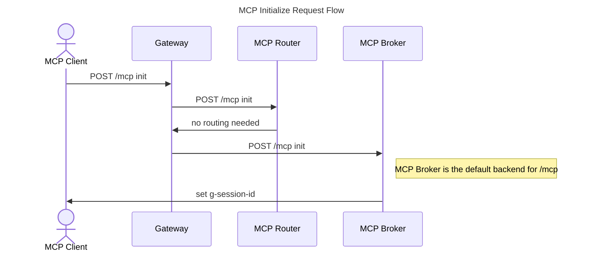

# MCP Gateway Request Flows

## Init:

```mermaid
sequenceDiagram
        title MCP Initialize Request Flow 
        actor MCP Client
        MCP Client->>Gateway: POST /mcp init
        Gateway->>MCP Router: POST /mcp init
        MCP Router->>Gateway: no routing needed
        Gateway->>MCP Broker: POST /mcp init
        note right of MCP Broker: MCP Broker is the default backend for /mcp
        MCP Broker->>MCP Client: set g-session-id
        
```