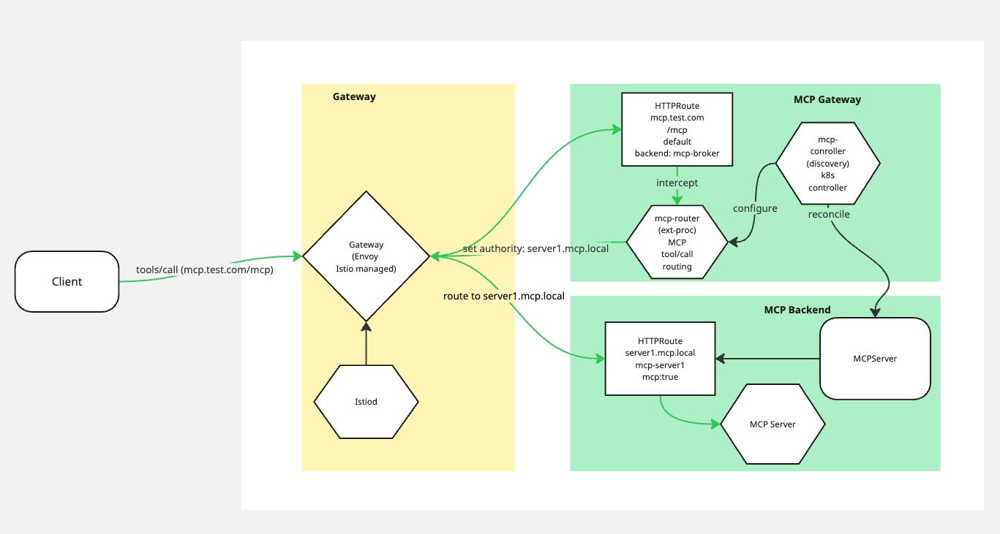

## Routing

### Problem

In order to expose MCP Servers, the MCP Gateway aggregates the available tools from the registered backend MCP servers and presents them as a single tool set to agent applications. As there is only one endpoint expected by the agent: https://<host>/mcp , the gateway needs to be able to accept tools/call requests at that endpoint and then be able to make a routing decision about which backend MCP server should receive the call.

### Solution

> Note: In describing the solution [Gateway API](https://gateway-api.sigs.k8s.io/) and Kubernetes are used as the basis for defining and deploying routes and gateways. It is worth mentioning that the result of all these APIs is config that is eventually consumed by Envoy and as such could be done without the need for the Gateway API resources.

Our solution to this is to intercept the tools/calls hitting the /mcp endpoint before envoy routes them and then based on the configured MCPServer set the `authority:` header to force the routing decision of envoy to choose the corrrect backend. Setting the `authority:` header allows for distinct routing and hostname per MCP backend. 

### The Router

The router component is configured to know about the different backend MCP Servers that have been registered. This configuration is managed by the MCP Controller component. The router intercepts requests to the gateway before routing has happened and based on its configuration decides whether to route or ignore these requests. The router only routes `tools/calls`.

#### The MCPServer resource

The MCP Server resource is a kuberentes CRD used to register and configure an MCP server to be exposed via the Gateway. It targets a HTTPRoute and sets some additional configuration. This resource is reconciled by the MCP Controller into configuration that the router can consume to make routing decisons. 

#### The Routes

To configure the MCP Gateway we have two different routes with distinct routing responsibilities:

- **The MCP Gateway Route:** This route is how agents interact with the Gateway and is intented to be the route exposed for use (for example via a DNS resolvable hostname). The default backend for this route must be the MCP Broker component. From a client perspective this endpoint acts as an MCP Server.[Example](../../config/mcp-system/httproute.yaml). Although it will recieve tools/calls it does not directly handle tools/calls.

- **Individual MCP Server Routes:** These are intended to route to individual MCP Servers that can handle distinct tools/calls from a client. There can be many of these routes but there is expected to be a 1:1 relationship between a route and a MCP Backend. Each MCP Server route should have some form of hostname set. The hostname used, is not hugely important as it is not expected to be DNS resolvable. In our examples we use `mcp.local`. Each route should have a single rule that points at the MCP backend. [Example](../../config/test-servers/server1-httproute.yaml).

#### The Gateway

The Gateway is an instance of envoy managed by an Istio control plane. To have a gateway that can serve as an MCP Gateway you will need to define two listeners:

1) For the main MCP Gateway Route 
2) For attaching MCP Server Routes 

[Example Gateway](../../config/istio/gateway/gateway.yaml)
