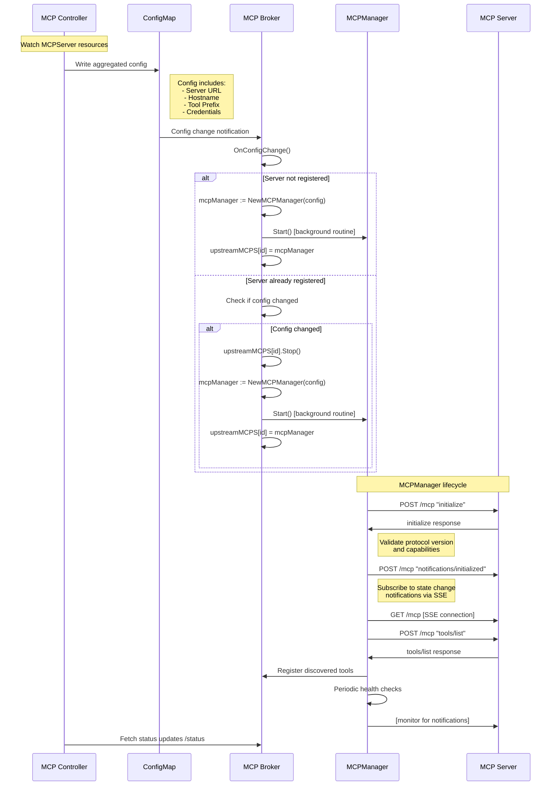

## MCP Server Registration

### Problem

The MCP Gateway needs to discover and register backend MCP servers so that their tools can be aggregated and presented to clients as a unified MCP server. When an MCPServer custom resource is created or updated in Kubernetes, the MCP Controller must:

1. Discover the MCP server endpoint from the referenced HTTPRoute
2. Update the broker and router configuration
3. Initialize connections to the backend MCP server
4. Discover available tools
5. Register for state change notifications
6. Handle configuration changes and server lifecycle

The broker needs a robust mechanism to manage the lifecycle of each upstream MCP server connection, including periodic health checks, reconnection logic, and graceful handling of configuration changes.

### Solution

The MCP Gateway uses a two-phase registration process:

1. **Controller Phase**: The MCP Controller watches for MCPServer resources, discovers server endpoints from HTTPRoutes, and writes aggregated configuration to ConfigMaps
2. **Broker Phase**: The MCP Broker reads configuration changes and manages each upstream MCP server through an `MCPManager` that handles the full lifecycle of the connection

Each upstream MCP server is managed by a dedicated `MCPManager` instance that runs as a background routine, handling:
- Initial connection and discovery
- Periodic health checks and reconnection
- State change notification subscriptions such as `notifications/tools/list_changed`
- Graceful shutdown

### Registration Flow

### MCPManager Responsibilities

The `MCPManager` is responsible for managing a single upstream MCP server connection. It handles:

1. **Initialization**: Establishes connection, validates protocol version and capabilities
2. **Discovery**: Fetches initial tool list and registers tools with the broker
3. **Notification Subscription**: Sets up SSE connection for state change events
4. **Health Monitoring**: Periodically checks connection health and reconnects if needed
5. **Notification Handling**: Processes state change notifications and forwards them to the broker
6. **Graceful Shutdown**: Cleans up connections and resources when stopped

### State Change Notifications

The MCPManager subscribes to state change notifications from the upstream MCP server:

- `notifications/tools/list_changed`
- `notifications/resources/list_changed`
- `notifications/prompts/list_changed`
- `notifications/roots/list_changed`

When a notification is received, the MCPManager:
1. Updates its internal state (e.g., re-fetches tool list)
2. Forwards the notification to the broker
3. The broker forwards it to all connected clients

For more details, see the [notifications design documentation](./notifications.md).

### Error Handling and Retry Logic

The MCPManager implements exponential backoff retry for:
- Initial connection failures
- Discovery failures
- Health check failures
- Notification connection drops

Retries are handled in background routines to avoid blocking the main broker operations.

### Status and Health

The broker exposes status information about registered servers:
- Connection status
- Last successful discovery time
- Tool count
- Error messages (if any)

This information is available via the `/status` endpoint for debugging and monitoring.

