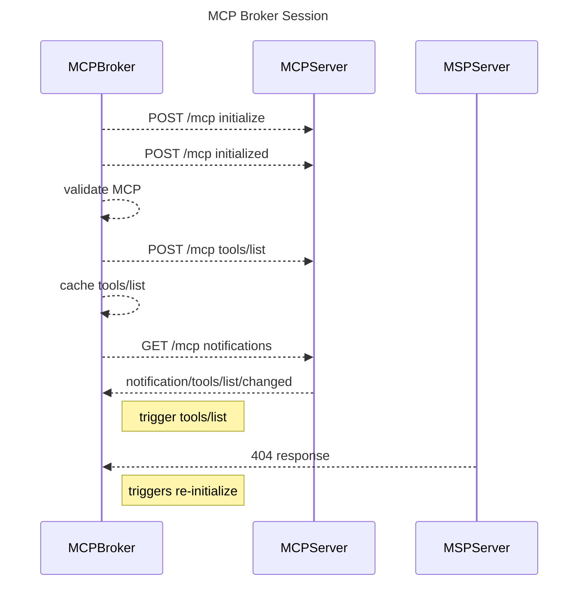
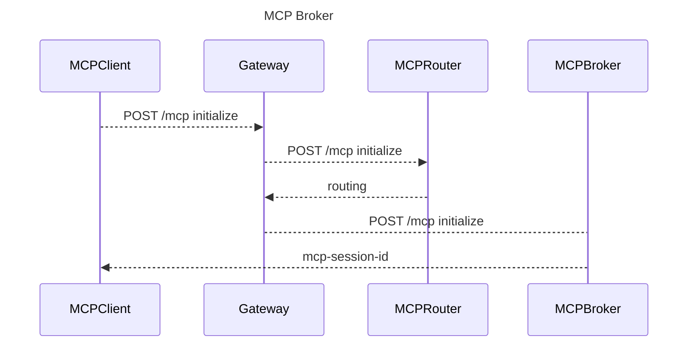
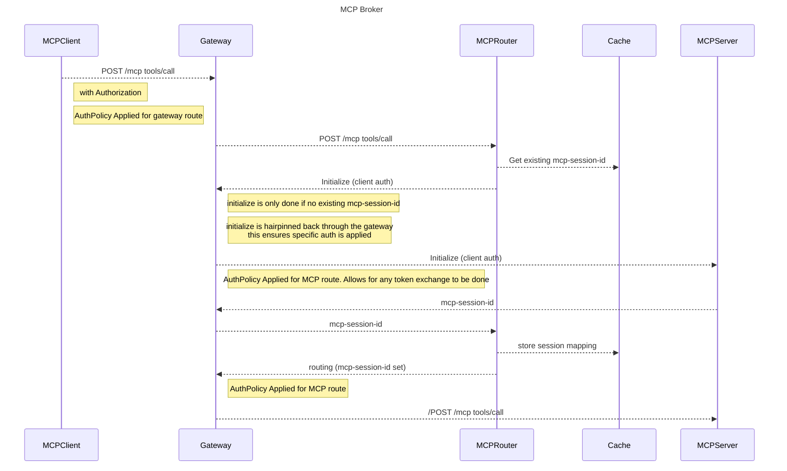

# Session Management

The MCP Protocol is stateful. Providing an MCP Gateway, requires us to think about how to manage long lived sessions between clients and backend MCP Severs. This document covers how the MCP Gateway manages sessions.

## Types of session

There are three types of session managed within the MCP Gateway components to provide its capabilities:

- **MCP Broker Sessions: MCP Broker -> MCP Server** Sessions between MCP Servers and the MCP Broker component.
- **Gateway Sessions: MCP Client -> MCP Gateway** A session between "the gateway" and the MCP Client. 
- **Client backend MCP Server Session: MCP Gateway -> MCP Server sessions** Sessions negotiated for MCP clients using the gateway and target MCP servers. 

### How each type is handled

MCP Broker sessions are managed by each broker instance in memory. They are authenticated via a long lived (service account for example) credential provided when registering an MCPServer with the gateway. This session is specific to the broker instance and is used to register, validate, initialize, retrieve tools/lists and register for broadcast type notifications such as tools/list_changed. This session is not used during a client interaction.

The MCP Broker component acts as generic MCP Backend to clients of the MCP Gateway. Several of the MCP requests types are routed to the MCP Broker. As such, the gateway session ids are assigned by the broker component in response to an initialize call against the gateway from a client. This is a separate session from the previously mentioned broker session. It is this gateway session that is sent back to the client via the `mcp-session-id` header and (as per the spec) is sent in subsequent requests by the client to the gateway. This session is a JWT and is used as a key by the gateway in order to map backend MCP Server sessions to a single client session with the gateway. A gateway session can only be obtained via an initialize request. 

MCP Client to MCP Server sessions are managed by the router component. Each client receives a "gateway mcp-session-id" during initialization. This session is a JWT and is then used as a key to map sessions from MCP servers fronted by the gateway. The router performs a lazy initialization in order to reduce resource usage, open connections and latency. When a tools/call hits the router, it will look up this session map based on the passed gateway mcp-session-id and find the session-id for targeted MCP server before setting that at the `mcp-session-id` header. These session mappings are stored in memory. However in a scaled environment, there is no way to ensure a client always hits a particular instance of the router (ext_proc) service. So this state needs to be shared. 

### Session Clean up and invalidation

Clients can send a DELETE request to gateway, this will be handled by the MCP Broker and result in the session being removed along with all mapped sessions. 

If the router intercepts a 404 response from an MCP server, as per the spec this is interpreted as a invalid session response. The associated MCP backend session, is removed from the cache in response.

## Lazy Initialization

With this approach, when a server is registered with the gateway, the broker will initialize with it and ask for a tools/list which it caches and will return when a client asks for a tools/list.

When a client wants to make a tools/call, the gateway, will initialize with the target MCP Server lazily in response to that request using the client's credentials etc. This allows for per MCP auth (example using an API Key instead of OAuth Token). Any session created on behalf of a client is cached for re-use on future calls. The gateway will intercept any 404 responses during a tools/call (which as per the spec means the session is invalid), and will remove the session from the cache forcing a new initialization when subsequent tool calls come in from the client. 

This approach has two main considerations. 

-  sharing the sessions across instances of the router in a scaled environment.
-  allowing more advanced MCP servers to respond with a "filtered" list based on the client identity rather than the brokers identity.

To solve the first issue, we will introduce the capability of connecting the gateway to shared redis store where the session mappings will be stored and accessible to other instances.

To solve the second issue, we will allow an MCP server to indicate that it provides per client listing capabilities. In this case, the MCP Broker will not do a tools/list but instead when a tools/list call comes in, it will use the client identity to make the tools/list call against only the MCP servers that provide this capability and then aggregate the tools list with the client specific response in to a session based cache.

## Why not Fan Out

We don't store the mapped session-ids in the JWT as this would require us to change the value of the mcp-session-id sent by gateway and while clients may obey this change in value, it is not a specified behavior. The only request where a client expects this session to be set is from a initialize.

Additionally, any time a mapped session timed out or was cleaned up, we would need to force a re-initialize from the client as we cannot rely on changing the session value without a fresh initialize as this is not part of the spec.

Finally there are perceived performance and scalability issues as we would need to initialize potentially many MCP servers. This has meant we have stayed away from that approach for now.

While we are not using a fan out approach currently. There may come a time when it makes sense and performance allows for it. A key piece would be allowing the session value to change without the need for a new initialize call.

Benefit:
- A fan out approach would potentially allow the session mapping to be stored with the client as part of the JWT mcp-session-id provided by the gateway.

- Tools/Lists can be filtered for the user directly. As we are retrieving the tools/list with the client connection open, a filtered list of tools could be provided by the MCP server.
