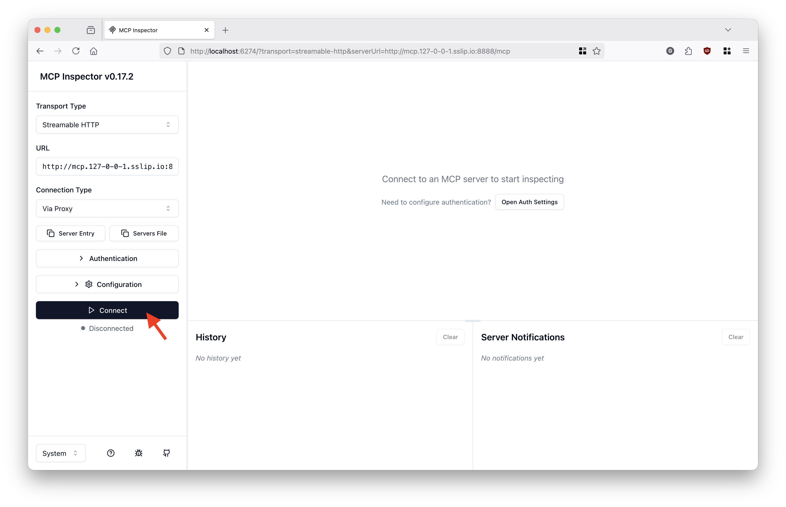
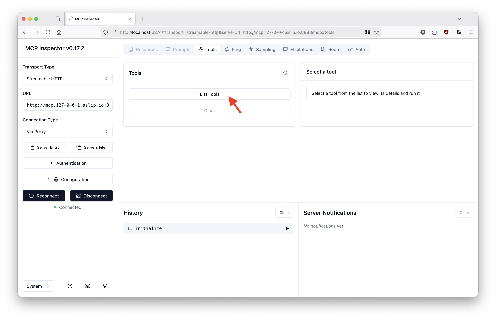
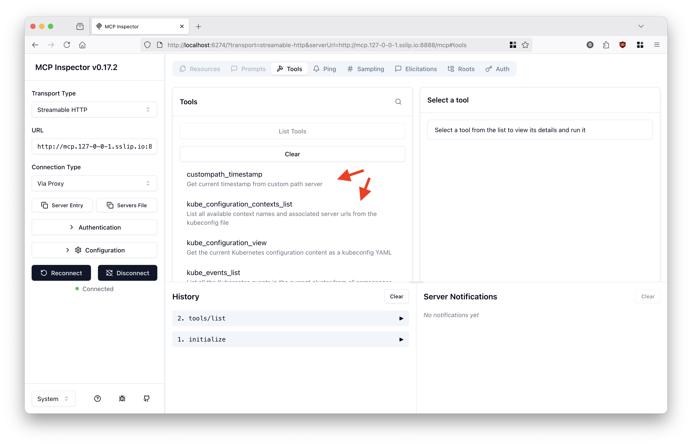
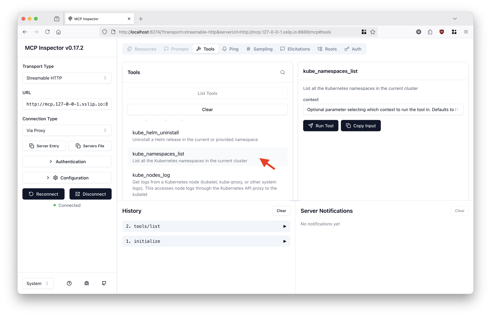
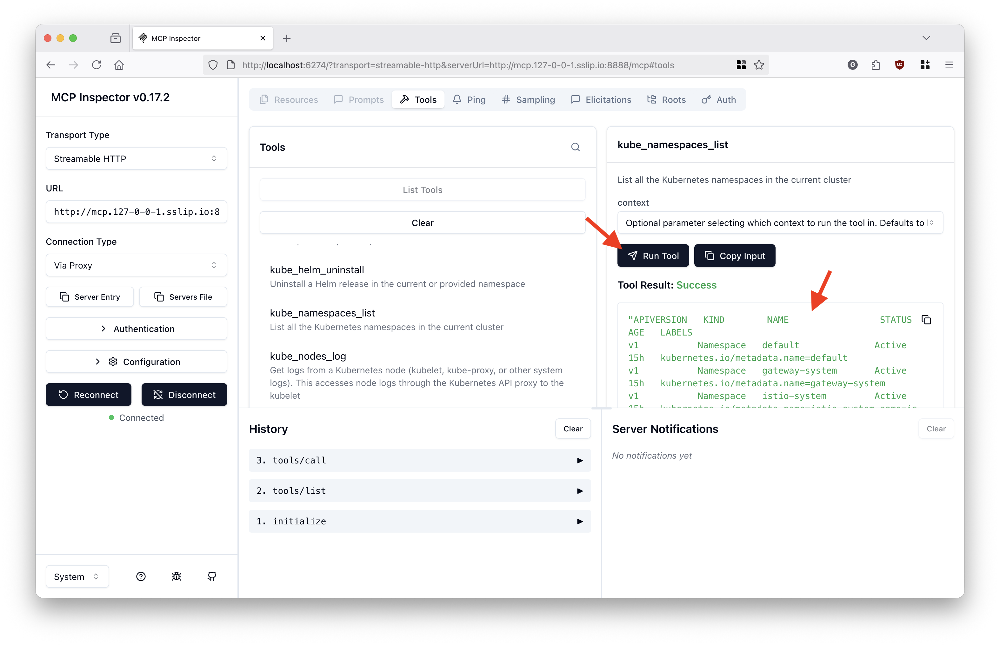

# Kubernetes MCP Server

This guide demonstrates how to add the [Kubernetes MCP server](https://github.com/containers/kubernetes-mcp-server) as an external MCP server behind the MCP Gateway.

The Kubernetes MCP server runs on the local machine alongside a Kubernetes Kind cluster that has the MCP Gateway stack deployed to it.

This demo is part of a 3-use case series:

1. [No auth](#use-case-1-no-auth) ✅
2. [OIDC auth](#use-case-2-oidc-auth) ✅
3. [Cross-domain auth](#use-case-3-cross-domain-auth)

<br/>

## Use case 1: No auth

In this use case, the Kubernetes MCP server does not handle authentication for the client. It uses the access from the current `.kube/config` file to connect to the known Kubernetes clusters when tools are called.

### ❶ Setup a local cluster with the MCP Gateway stack

Clone the MCP Gateway repo (so you have the tooling to easily setup a local dev/test environment):

```sh
git clone git@github.com:kagenti/mcp-gateway.git && cd mcp-gateway
```

Create a local cluster with MCP Gateway:

```sh
make local-env-setup
```

### ❷ Run the Kubernetes MCP server locally

Clone the Kubernetes MCP server repo:

```sh
git clone git@github.com:containers/kubernetes-mcp-server.git && cd kubernetes-mcp-server
```

Build a fresh new version of the MCP server:

```sh
make build
```

Run the MCP server on port 9999:

```sh
./kubernetes-mcp-server --port 9999
```

> **Note:** The command above will hold the shell. Start a new session to run the next steps.

### ❸ Register the MCP server with the MCP Gateway

Add a dedicated gateway listener for the MCP server:

```sh
export CONTAINERS_HOSTNAME=$(which podman &>/dev/null && echo "host.containers.internal" || echo "host.docker.internal")

kubectl patch gateway mcp-gateway -n gateway-system --type json -p="[
  {
    \"op\": \"add\",
    \"path\": \"/spec/listeners/-\",
    \"value\": {
      \"name\": \"kubernetes-mcp\",
      \"hostname\": \"$CONTAINERS_HOSTNAME\",
      \"port\": 8080,
      \"protocol\": \"HTTP\",
      \"allowedRoutes\": {
        \"namespaces\": {
          \"from\": \"All\"
        }
      }
    }
  }
]"
```

Create a route, external service and `MCPServer` custom resource:

```sh
kubectl apply -n mcp-test -f - <<EOF
apiVersion: gateway.networking.k8s.io/v1
kind: HTTPRoute
metadata:
  name: kubernetes-mcp
spec:
  parentRefs:
  - group: gateway.networking.k8s.io
    kind: Gateway
    name: mcp-gateway
    namespace: gateway-system
  hostnames:
  - $CONTAINERS_HOSTNAME
  rules:
  - matches:
    - path:
        type: PathPrefix
        value: /mcp
    backendRefs:
    - group: ""
      kind: Service
      name: kubernetes-mcp-external
      port: 9999
---
apiVersion: v1
kind: Service
metadata:
  name: kubernetes-mcp-external
spec:
  type: ExternalName
  externalName: $CONTAINERS_HOSTNAME
  ports:
  - name: http
    port: 9999
    targetPort: 9999
    protocol: TCP
    appProtocol: http
---
apiVersion: networking.istio.io/v1beta1
kind: ServiceEntry
metadata:
  name: kubernetes-mcp
  namespace: mcp-test
spec:
  hosts:
  - $CONTAINERS_HOSTNAME
  ports:
  - number: 9999
    name: https
    protocol: HTTP
  location: MESH_EXTERNAL
  resolution: DNS
---
apiVersion: mcp.kagenti.com/v1alpha1
kind: MCPServer
metadata:
  name: kubernetes-mcp-server
spec:
  toolPrefix: kube_
  targetRef:
    group: gateway.networking.k8s.io
    kind: HTTPRoute
    name: kubernetes-mcp
EOF
```

### ❹ Try the MCP server behind the gateway

From the MCP gateway repo, run the following command to launch the MCP Inspector on your default web browser:

```sh
make inspect-gateway
```

In the MCP Inspector, click _Connect_:



List the available MCP tools:



Notice the multiple MCP tools from various test MCP servers behind the gateway, including tools from the Kubernetes MCP server (prefixed with `kube_`):



Select Kubernetes MCP server's `namespaces_list` tool:



Call the tool:



<br/>

## Use case 2: OIDC auth

This use case handles OIDC authentication with token passthrough from the Kubernetes MCP server to the Kubernetes clusters.

The accessible Kubernetes API servers accept same-domain OIDC access tokens, which are obtained by the MCP gateway on behalf of the MCP clients via Standard OAuth2 Token Exchange.

**Requisite:** You have successfully completed [Use case 1: No auth](#use-case-1-no-auth).

### ❶ Enable auth for `tool/list` and `tool/call` requests in the MCP Gateway

```sh
make oauth-token-exchange-example-setup
```

### ❷ Create an AuthPolicy for the Kubernetes MCP server route

```sh
kubectl apply -f -<<EOF
apiVersion: kuadrant.io/v1
kind: AuthPolicy
metadata:
  name: kubernetes-mcp-auth-policy
  namespace: mcp-test
spec:
  targetRef:
    group: gateway.networking.k8s.io
    kind: HTTPRoute
    name: kubernetes-mcp
  rules:
    authentication: #validates the token
      'keycloak':
        jwt:
          issuerUrl: https://keycloak.127-0-0-1.sslip.io:8002/realms/mcp
    metadata:
      oauth-token-exchange:
        when:
          - predicate: type(auth.identity.aud) != string || auth.identity.aud != request.headers['x-mcp-servername']
        http:
          url: https://keycloak.127-0-0-1.sslip.io:8002/realms/mcp/protocol/openid-connect/token
          method: POST
          credentials:
            authorizationHeader:
              prefix: Basic
          sharedSecretRef:
            name: token-exchange
            key: oauth-client-basic-auth
          bodyParameters:
            grant_type:
              value: urn:ietf:params:oauth:grant-type:token-exchange
            subject_token:
              expression: request.headers['authorization'].split('Bearer ')[1] # remove "Bearer "
            subject_token_type:
              value: urn:ietf:params:oauth:token-type:access_token
            audience:
              expression: request.headers['x-mcp-servername']
            scope:
              value: openid profile groups
    authorization:
      'token':
        opa:
          rego: |
            scoped_jwt := object.get(object.get(object.get(input.auth, "metadata", {}), "oauth-token-exchange", {}), "access_token", "")
            jwt := j { scoped_jwt != ""; j := scoped_jwt }
            jwt := j { scoped_jwt == ""; j := split(input.request.headers["authorization"], "Bearer ")[1] }
            claims := c { [_, c, _] := io.jwt.decode(jwt) }
            allow = true
          allValues: true
        priority: 0
      'scoped-audience-check':
        patternMatching:
          patterns:
            - predicate: has(auth.authorization.token.claims.aud) && type(auth.authorization.token.claims.aud) == string && auth.authorization.token.claims.aud == request.headers['x-mcp-servername']
        priority: 1
      'tool-access-check':
        patternMatching:
          patterns:
            - predicate: |
                request.headers['x-mcp-toolname'] in (has(auth.authorization.token.claims.resource_access) && auth.authorization.token.claims.resource_access.exists(p, p == request.headers['x-mcp-servername']) ? auth.authorization.token.claims.resource_access[request.headers['x-mcp-servername']].roles : [])
        priority: 1
    response:
      success:
        headers:
          authorization:
            plain:
              expression: |
                "Bearer " + auth.authorization.token.jwt
      unauthenticated:
        code: 401
        headers:
          'WWW-Authenticate':
            value: Bearer resource_metadata=http://mcp.127-0-0-1.sslip.io:8888/.well-known/oauth-protected-resource/mcp
        body:
          value: |
            {
              "error": "Forbidden",
              "message": "MCP Tool Access denied. Unauthenticated."
            }
      unauthorized:
        code: 403
        body:
          value: |
            {
              "error": "Forbidden",
              "message": "MCP Tool Access denied. Insufficient permissions for this tool."
            }
EOF
```

### ❸ Authorize the `mcp` Keycloak user for the Kubernetes API server

```sh
kubectl apply -f -<<EOF
apiVersion: rbac.authorization.k8s.io/v1
kind: ClusterRoleBinding
metadata:
  name: oidc-mcp-cluster-admin
roleRef:
  apiGroup: rbac.authorization.k8s.io
  kind: ClusterRole
  name: cluster-admin
subjects:
- apiGroup: rbac.authorization.k8s.io
  kind: User
  name: https://keycloak.127-0-0-1.sslip.io:8002/realms/mcp#mcp
EOF
```

### ❹ Try the MCP server behind the gateway with OIDC authentication and token exchange performed by the MCP gateway

Follow the same steps as [before](#-try-the-mcp-server-behind-the-gateway) to try the MCP server behind the gateway using the MCP Inspector as client.

> **Note:** You may need to add an exception for your browser to trust the Keycloak self-signed server certificate.

When redirected to the Keycloak login page, authenticate with username/password: `mcp` / `mcp`.

The tool/list response shall now be filtered only to the tools the `mcp` user has access to.

When calling any of the Kubernetes MCP server tools, an authentication token such as the following ones shall be the obtained and injected by the MCP gateway into the request to the MCP server. The MCP server will pass the thoken through to the Kubernetes API server for authentication:

```json
{
  "aud": "mcp-test/kubernetes-mcp",
  "azp": "mcp-gateway",
  "exp": 1763123081,
  "family_name": "mcp",
  "given_name": "mcp",
  "groups": [
    "accounting",
    "engineering",
    "mcp-users"
  ],
  "iat": 1763121281,
  "iss": "https://keycloak.127-0-0-1.sslip.io:8002/realms/mcp",
  "jti": "ntrtte:1a144de4-8206-3ae1-1c12-9e67a5cc207f",
  "name": "mcp mcp",
  "preferred_username": "mcp",
  "resource_access": {
    "mcp-test/kubernetes-mcp": {
      "roles": [
        "configuration_view",
        "nodes_log",
        "nodes_stats_summary",
        "pods_list",
        "pods_delete",
        "resources_delete",
        "pods_run",
        "pods_exec",
        "helm_list",
        "pods_log",
        "resources_get",
        "resources_list",
        "nodes_top",
        "namespaces_list",
        "helm_uninstall",
        "configuration_contexts_list",
        "events_list",
        "pods_get",
        "helm_install",
        "pods_top",
        "resources_create_or_update",
        "pods_list_in_namespace"
      ]
    }
  },
  "scope": "openid profile groups",
  "sid": "b8298efe-69a0-4f89-99d4-aec3c921bdeb",
  "sub": "df901145-417d-493b-9c54-7869f08c7b72",
  "typ": "Bearer"
}
```

<br/>

## Use case 3: Cross-domain auth

This use case handles token exchange across different auth domains so multiple Kubernetes clusters can be called by the MCP server, with each cluster deployed to its own OIDC domain.

-- TODO --
